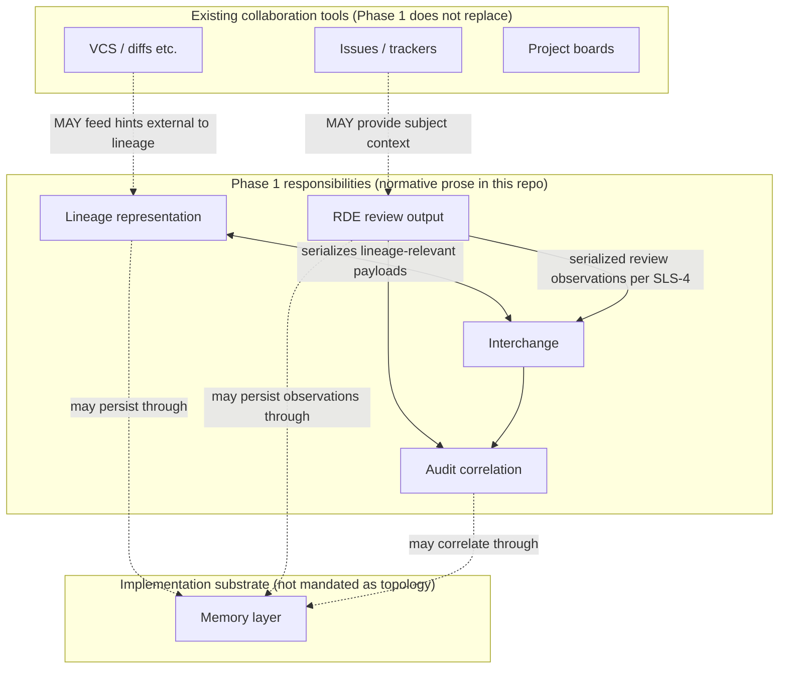
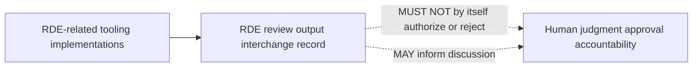

# SLS-2 Architecture (logical)

## SLS-2.1 Overview

SLS, as specified for Phase 1, comprises **logical responsibilities** that implementations MAY map to separate modules or combine. This document does not mandate deployment topology.

*Non-normative Japanese illustrative companion:* [architecture_ja.md](architecture_ja.md).

## SLS-2.2 Concept list *(informative only)*

The following table summarizes the concepts used by this architecture document. It is a reading aid; normative definitions remain in [SLS-1](introduction.md) and the relevant Phase 1 documents.

| Concept | Role in this architecture | Primary specification anchor |
| --- | --- | --- |
| **Kotonoha** | Ecosystem and institutional framing for SLS specifications, policies, and implementations | [SLS-1.4.2](introduction.md) |
| **SLS** | System family for recording semantic lineage across meaning-relevant changes | [SLS-1.4.1](introduction.md) |
| **Semantic lineage** | Directed, inspectable relationship among lineage units | [SLS-1.4.3](introduction.md) |
| **Lineage unit** | Minimal persisted subject of semantic lineage | [SLS-3](semantic-lineage-model.md) |
| **Memory layer** | Implementation substrate that stores lineage units, prior RDE outputs, source references, and audit correlation data without replacing the lineage model itself | [SLS-3](semantic-lineage-model.md), [SLS-7](audit-trail-relationship.md) |
| **ΔM** | Meaning-relevant change, distinct from raw textual diff | [SLS-1.4.5](introduction.md) |
| **RDE review** | Structured observation of semantic deviation using RDE categories | [SLS-4](rde-review-output.md) |
| **RDE implementation** | Component or workflow that produces, validates, or manages RDE observations while preserving human authority boundaries | [SLS-5](rde-implementation-specification.md) |
| **Interchange** | Serialized representation for exchanging lineage and RDE payloads between tools | [SLS-4](rde-review-output.md), [SLS-8](versioning.md) |
| **Representation of loss** | Explicit surfacing of semantic elements that are removed, weakened, or no longer represented | [SLS-6](representation-of-loss.md) |
| **Audit correlation** | Correlatable relationship between review outputs, lineage records, and audit trails | [SLS-7](audit-trail-relationship.md) |
| **Human authority** | Human judgment and accountability for publication, approval, rejection, or revision | [SLS-1.8](introduction.md) |

## SLS-2.3 Figures *(informative only)*

Diagrams below **illustrate** relationships described in prose. If a diagram and a normative section conflict, **the normative text prevails.**

### SLS-2.3.1 Figure 1 — Logical responsibilities and interchange

### SLS-2.3.2 Figure 2 — RDE observations vs human authority

## SLS-2.4 Logical components

### SLS-2.4.1 Lineage representation

**Responsibility:** persist and expose **lineage units** and their relationships according to [SLS-3](semantic-lineage-model.md).

**Non-requirements:** replacing Git, issue trackers, or project boards. Those tools **MAY** coexist; SLS addresses semantic lineage they do not fully capture.

### SLS-2.4.2 Memory layer *(informative implementation substrate)*

**Responsibility:** provide durable access to lineage units, source references, prior RDE review outputs, loss observations, and audit-correlation identifiers as needed by an implementation.

**Positioning:** the memory layer is below the logical responsibilities rather than above them. It supports lineage representation, RDE review output, interchange, and audit correlation, but it does **not** define semantic lineage by itself and it does **not** authorize decisions.

**Boundary:** Phase 1 does not mandate a storage engine, database model, vector index, graph store, filesystem layout, or retention policy. Implementations MAY combine memory with the lineage representation component, or expose it as a separate module, provided the externally visible obligations in the Phase 1 documents remain satisfied.

### SLS-2.4.3 RDE review output

**Responsibility:** produce or consume **RDE review outputs** structured per [SLS-4](rde-review-output.md), covering the observation categories listed there. Components claiming RDE implementation behavior are further constrained by [SLS-5](rde-implementation-specification.md).

**Boundary:** an RDE review output records observations; it **MUST NOT**, by itself, normatively **authorize** or **reject** human decisions.

### SLS-2.4.4 Interchange

**Responsibility:** serialize RDE review outputs and lineage data for exchange between tools using the minimal interchange rules defined in Phase 1. Detailed schema evolution is governed by [SLS-8](versioning.md).

### SLS-2.4.5 Audit correlation

**Responsibility:** implementations that maintain audit trails **SHOULD** preserve a correlatable relationship between RDE review outputs and audit records as described in [SLS-7](audit-trail-relationship.md).

## SLS-2.5 Trust and scope boundaries

Phase 1 specifies **structural and documentary obligations**. It does **not** specify threat models, authentication, or availability targets (future phases MAY extend the specification).

## SLS-2.6 Traceability

Implementations **SHOULD** maintain explicit references (for example section identifiers) between behavior and the relevant normative sections in this repository.

## SLS-2.7 Implementation structuring *(informative only)*

Phase 1 **does not** mandate repository layout, module shapes, or the use of object-oriented **design patterns** in code.

The following **evolution signals** MAY warrant implementer-side **refactoring** — for example clearer decomposition, composition, or per-version validation paths — as long as externally visible obligations in this specification **do not** silently change ([SLS-8](versioning.md); traceability preserved):

| Signal | Typical direction *(examples only; not requirements)* |
| --- | --- |
| Multiple concurrently supported **interchange** shapes or **`spec_bundle` / spec version** validation lines | Separate validation per format or bundle (e.g. `enum` / `match`, small modules, traits) instead of one intersecting routine |
| **RDE** rules spread independently and regressions multiply | Factor rules into testable units; avoid an unnecessary monolithic validator |
| More than one **persistent or transport backend** behind the same behavioral contract | Shared interface with adapter-specific implementations |
| The same conformance logic is **duplicated** across crates or CLIs | Extract shared helpers or types **without** relaxing normative checks |

Prefer idiomatic structure in each language (e.g. Rust: traits, enums, composition). Internal engineering mirrors MAY expand on timing; they are **not** normative here.

## SLS-2.8 Reference interchange *(informative only)*

OSS implementations MAY attach conformance metadata via the **`kotonoha.interchange.v1`** vocabulary defined in **[`src/interchange.rs`](https://github.com/zyx-corporation/kotonoha-core/blob/main/src/interchange.rs)** in **`kotonoha-core`**. This format guides validators and tooling; when it diverges from normative wording in Phase 1, **the Phase 1 English documents prevail** until superseded according to [SLS-8](versioning.md).

**Informative tightening in `kotonoha-core` (Phase 2 tooling):** current releases **`#[serde(deny_unknown_fields)]` on deserialization** — the interchange JSON object **MUST NOT** carry unknown **top‑level** keys (`format`, `spec_bundle`, `lineage_unit`, `rde_document` only); when `lineage_unit` is present, that nested object **`id` / `prior_unit_id` only**. This guards against unstructured extensions being mistaken for contract evolution **without** extending Phase 1 normative requirements in `docs/` here.

The official **[`kotonoha` CLI definition](https://github.com/zyx-corporation/kotonoha-cli/blob/main/docs/cli-definition.md)** documents command surfaces, interchange validation/storage paths, and exit-code semantics referenced from contributor guides; it likewise remains informative relative to canonical requirements in `docs/`.
