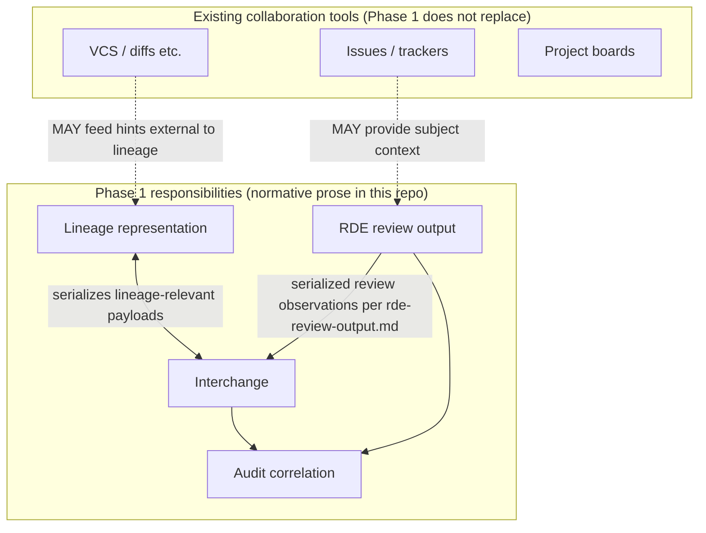
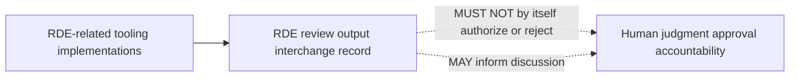

# Architecture (logical)

## Overview

SLS, as specified for Phase 1, comprises **logical responsibilities** that implementations MAY map to separate modules or combine. This document does not mandate deployment topology.

*Non-normative Japanese illustrative companion:* [architecture_ja.md](architecture_ja.md).

## Figures *(informative only)*

Diagrams below **illustrate** relationships described in prose. If a diagram and a normative section conflict, **the normative text prevails.**

### Figure 1 — Logical responsibilities and interchange

### Figure 2 — RDE observations vs human authority

## Logical components

### Lineage representation

**Responsibility:** persist and expose **lineage units** and their relationships according to [semantic-lineage-model.md](semantic-lineage-model.md).

**Non-requirements:** replacing Git, issue trackers, or project boards. Those tools **MAY** coexist; SLS addresses semantic lineage they do not fully capture.

### RDE review output

**Responsibility:** produce or consume **RDE review outputs** structured per [rde-review-output.md](rde-review-output.md), covering the observation categories listed there.

**Boundary:** an RDE review output records observations; it **MUST NOT**, by itself, normatively **authorize** or **reject** human decisions.

### Interchange

**Responsibility:** serialize RDE review outputs and lineage data for exchange between tools using the minimal interchange rules defined in Phase 1. Detailed schema evolution is governed by [versioning.md](versioning.md).

### Audit correlation

**Responsibility:** implementations that maintain audit trails **SHOULD** preserve a correlatable relationship between RDE review outputs and audit records as described in [audit-trail-relationship.md](audit-trail-relationship.md).

## Trust and scope boundaries

Phase 1 specifies **structural and documentary obligations**. It does **not** specify threat models, authentication, or availability targets (future phases MAY extend the specification).

## Traceability

Implementations **SHOULD** maintain explicit references (for example section identifiers) between behavior and the relevant normative sections in this repository.

## Reference interchange (informative only)

OSS implementations MAY attach conformance metadata via the **`kotonoha.interchange.v1`** vocabulary defined in **[`src/interchange.rs`](https://github.com/zyx-corporation/kotonoha-core/blob/main/src/interchange.rs)** in **`kotonoha-core`**. This format guides validators and tooling; when it diverges from normative wording in Phase 1, **the Phase 1 English documents prevail** until superseded according to [versioning.md](versioning.md).

The official **[`kotonoha` CLI definition](https://github.com/zyx-corporation/kotonoha-cli/blob/main/docs/cli-definition.md)** documents command surfaces, interchange validation/storage paths, and exit-code semantics referenced from contributor guides; it likewise remains informative relative to canonical requirements in `docs/`.
