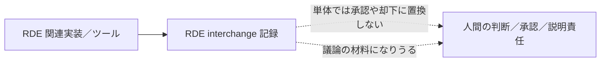

# アーキテクチャ（論理）—参考・日本語要約

**正本:** 規範は英語 **[`architecture.md`](architecture.md)**。本ページは**規範ではありません**。図表は英語版の **Figures** と対応し、論理構成の把握補助用です。

---

## 概要の要約

Phase 1 の SLS は **複数論理責務**の組み立てであり、モジュール分割や単一サービス構成などの **配置トポロジーまでは規定しない**（詳細は英語原版）。

---

## 図表 *(参考のみ)*

英語規範節との矛盾がある場合は **常に [`architecture.md`](architecture.md)** を優先します。

### Figure 1 — 論理責務と interchange（日本語ノード）

```mermaid
flowchart TB
    subgraph ext["既存協働ツール Phase 1 では代替しない"]
        VCS[VCS／差分等]
        ISS[Issue／チケット]
        BRD[プロジェクトボード]
    end

    subgraph p1["Phase 1 論理責務 本文はこのリポの英文規範"]
        LR[lineage の表現]
        RDE[RDE レビュー出力]
        IX[Interchange]
        AUD[監査との相関]
    end

    VCS -. lineage 外のヒントとして .-> LR
    ISS -. レビュ対象コンテキスト .-> RDE

    LR <-->|lineage系ペイロードの列挙| IX
    RDE -->|rde-review-output に準拠する観測| IX
    RDE --> AUD
    IX --> AUD
```

### Figure 2 — RDE 観測と人的権威

---

## 論理コンポーネント以降について

本文の細目・MUST／SHOULD の全文はすべて **[architecture.md の Logical components](architecture.md)** 以降へ委譲します。

OSS 側の **`kotonoha.interchange.v1`** や **`kotonoha-cli` 定義** の位置づけは、英語版 **[Reference interchange (informative only)](architecture.md#reference-interchange-informative-only)** と同一の注意書きです。
