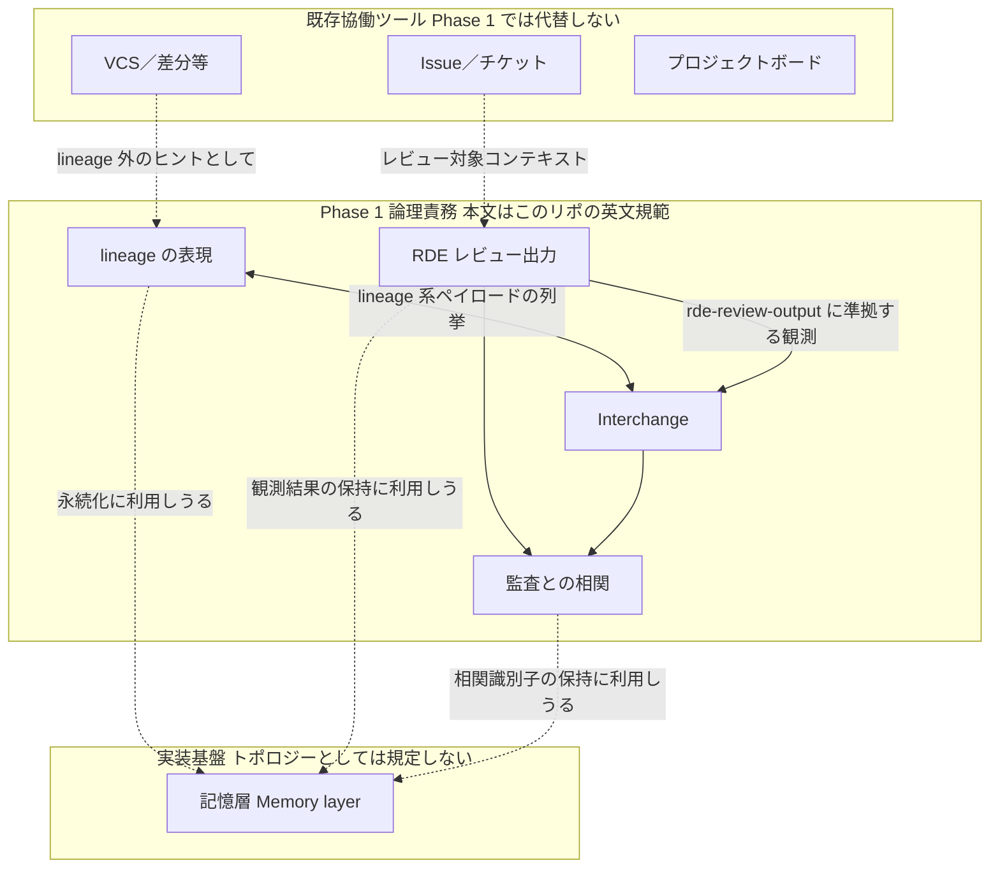
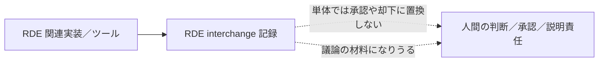

# アーキテクチャ（論理）—参考・日本語要約

**正本:** 規範は英語 **[`architecture.md`](architecture.md)**。本ページは**規範ではありません**。図表は英語版の **Figures** と対応し、論理構成の把握補助用です。

---

## 概要の要約

Phase 1 の SLS は **複数の論理責務**の組み立てであり、モジュール分割、単一サービス構成、データベース構成などの **配置トポロジーまでは規定しない**（詳細は英語原版）。

このページでは、英語版に追加された概念一覧と、記憶層（Memory layer）の位置づけを日本語で補足する。記憶層は RDE の内部部品ではなく、lineage unit、RDE 出力、loss、監査相関などを保持する**実装基盤層**として扱う。

あわせて、PR #33 以後の英語正本に合わせ、Kotonoha、SLS、RDE、Generator、UI、人間レビュー、policy engine の境界を補足する。SLS は意味を固定保存する仕組みではなく、意味変化を後から追跡・異議申し立て・再審できるようにする構造である。

---

## 概念一覧 *(参考のみ)*

以下の表は、英語版 **[Concept list](architecture.md#concept-list-informative-only)** の日本語対応である。規範上の定義は [`introduction.md`](introduction.md) および各 Phase 1 文書に従う。

| 概念 | このアーキテクチャでの役割 | 主な仕様アンカー |
| --- | --- | --- |
| **Kotonoha** | SLS の仕様、方針、実装を束ねるエコシステム上・制度上の枠組み | [introduction.md](introduction.md#kotonoha) |
| **SLS** | 意味に関わる変更をまたいで semantic lineage を記録するシステム群 | [introduction.md](introduction.md#semantic-lineage-system-sls) |
| **Semantic lineage** | lineage unit 間の有向で検査可能な関係。通常ログや raw diff そのものではない | [introduction.md](introduction.md#semantic-lineage) |
| **Lineage unit** | semantic lineage の最小永続対象 | [semantic-lineage-model.md](semantic-lineage-model.md) |
| **Memory layer** | lineage unit、過去の RDE 出力、source reference、audit correlation data を保持する実装基盤。ただし lineage model 自体を置換しない | [semantic-lineage-model.md](semantic-lineage-model.md), [audit-trail-relationship.md](audit-trail-relationship.md) |
| **Source context** | semantic change を解釈するための先行資料、意図、review note、issue context、制度的制約など | [introduction.md](introduction.md#source-context) |
| **Reviewability** | 人間または制度的 reviewer が semantic-change judgment を点検・異議申し立て・修正できること | [introduction.md](introduction.md#reviewability) |
| **ΔM** | raw text diff とは異なる、意味に関わる変化 | [introduction.md](introduction.md#δm-semantic-change) |
| **RDE review** | RDE category に基づく semantic deviation の構造化された観測 | [rde-review-output.md](rde-review-output.md) |
| **RDE implementation** | human authority boundary を保ちながら RDE observation を生成・検証・管理する component / workflow | [rde-implementation-specification.md](rde-implementation-specification.md) |
| **Interchange** | lineage と RDE payload をツール間で交換するための直列化表現 | [rde-review-output.md](rde-review-output.md), [versioning.md](versioning.md) |
| **Representation of loss** | 削除、弱化、未表現化された意味要素を明示する責務 | [representation-of-loss.md](representation-of-loss.md) |
| **Audit correlation** | review output、lineage record、audit trail の対応関係 | [audit-trail-relationship.md](audit-trail-relationship.md) |
| **Human authority** | 公開、承認、却下、修正に関する人間の判断と説明責任 | [introduction.md](introduction.md#human-accountability) |

---

## 図表 *(参考のみ)*

英語規範節との矛盾がある場合は **常に [`architecture.md`](architecture.md)** を優先します。

### Figure 1 — 論理責務と interchange（日本語ノード）

### Figure 2 — RDE 観測と人的権威

---

## 論理コンポーネントの補足

本文の細目・MUST／SHOULD の全文はすべて **[architecture.md の Logical components](architecture.md#logical-components)** 以降へ委譲します。ここでは、日本語で要点のみ補足する。

### Lineage representation

lineage unit とその関係を永続・公開する責務である。Git、Issue tracker、project board を置換するものではなく、それらが十分には保持しない意味履歴を扱う。

Semantic lineage は通常ログや raw diff に縮減されてはならない。ログは「何が起きたか」を示しうるが、semantic lineage は、保存・変換・補完・未解決・喪失・逸脱リスクなど、意味に関わる変化を後から点検できる関係を必要とする。

### Memory layer

記憶層は、lineage unit、source reference、過去の RDE review output、loss observation、audit-correlation identifier への永続アクセスを提供する実装基盤である。

重要なのは、記憶層が **RDEそのものではない** こと、また **semantic lineage の定義そのものでもない** ことである。記憶層は、lineage representation、RDE review output、interchange、audit correlation を支える下位基盤であり、人間の判断を承認・却下する権限も持たない。

Phase 1 では、storage engine、database model、vector index、graph store、filesystem layout、retention policy は規定しない。実装は、記憶層を lineage representation component と統合してもよいし、独立モジュールとして公開してもよい。ただし、外部から見える Phase 1 の義務を満たす必要がある。

### RDE review output

RDE は semantic deviation を観測し、構造化された review output として記録する責務である。RDE 出力は判断材料になりうるが、それ自体が人間の承認・却下・公開判断を置換してはならない。

SLS-4 では、RDE review output に任意の reviewability metadata を付与できる。たとえば evidence reference、source context status、confidence note、reviewer note、decision reference などである。ただし、これらは Phase 1 では任意であり、存在しても最終承認や policy enforcement を意味しない。

### Interchange

RDE 出力と lineage data をツール間で交換するための直列化責務である。詳細な schema evolution は [`versioning.md`](versioning.md) に従う。

### Audit correlation

RDE review output と audit record の対応関係を保持する責務である。これは制度的説明責任のための相関であり、単なる debug log ではない。

---

## 役割境界の補足（参考のみ）

英語版では、各責務の混同を避けるために role boundary が整理されている。要点は次のとおりである。

| 役割 | 主な責務 | 境界 |
| --- | --- | --- |
| Kotonoha framing | SLS 仕様・方針・実装を束ねる制度的枠組み | それ自体が実装の完全性や権威性を証明するわけではない |
| Lineage representation | lineage unit と semantic relationship の永続化 | 通常ログや raw diff に還元しない |
| Memory layer | lineage unit、source reference、RDE output、loss、audit correlation の保持 | semantic lineage 自体を定義せず、決定権限も持たない |
| Subject adapter | document、patch、decision、generated artifact などを review subject に整える | context 不足時に抽出結果を完全な semantic subject とみなさない |
| Context provider | source context と prior state を供給する | missing / partial / contested context を隠さない |
| RDE implementation | structured RDE observation を生成・検証・管理する | final approval / rejection / policy enforcement を主張しない |
| Generator | content、code、documentation、design artifact を生成・変換する | 自分自身の独立 evaluator として扱わない |
| Console / UI | lineage、RDE observation、context、decision を表示する | 自動観測を人間・制度の最終承認に見せない |
| Human / institutional review | semantic-change judgment を受容・却下・保留・再審する | 公開・承認・設計判断の責任を担う |
| Policy / safety engine | 外部 policy、access、safety、refusal decision を扱う | RDE observation とは別層。必要なら RDE output を消費できる |

---

## 実装側の構成整理（参考のみ）

Phase 1 は **リポジトリ構成やデザインパターンの採否を規定しません**。ただし実装が成長するにつれ、次のような**兆候**が出たときは、分解・合成・版別検証経路の分離などの**リファクタ**を検討してよい（**規範上の挙動を黙って変えない**こと。[`versioning.md`](versioning.md)、トレーサビリティ）。本文の表と例は英語版 **[Implementation structuring (informative only)](architecture.md#implementation-structuring-informative-only)** と対応します。

| 兆候 | 整理の方向（例／要件ではない） |
| --- | --- |
| **interchange** の複数形状や **`spec_bundle`／spec version** 系の検証が同居 | 版・形状ごとに検証を分離（`enum`／`match`、小モジュール、トレイト等） |
| **RDE** ルールが独立に増え、単一手続きでの回帰が重い | ルール単位に分割しテストしやすくする |
| **永続・転送**などバックエンドが複数 | 共通契約とアダプタ |
| **同じ適合チェック**がクレートや CLI 間で重複 | 共通ヘルパ・型へ抽出（規範の緩和と混同しない） |

言語ごとの慣用（Rust ならトレイト・列挙型・合成）を優先する。**社内のエンジニアリング転写**がタイミングを補足しうるが、規範本文ではない。

---

## Reference interchange について

OSS 側の **`kotonoha.interchange.v1`** や **`kotonoha-cli` 定義** の位置づけは、英語版 **[Reference interchange (informative only)](architecture.md#reference-interchange-informative-only)** と同一の注意書きです。**参考：** `kotonoha-core` Phase 2 実装は、deserialize 時に interchange **トップレベル**および **`lineage_unit` オブジェクトの未知フィールド**を拒否する（規範の追加ではなく、ツール側の契約収束）。