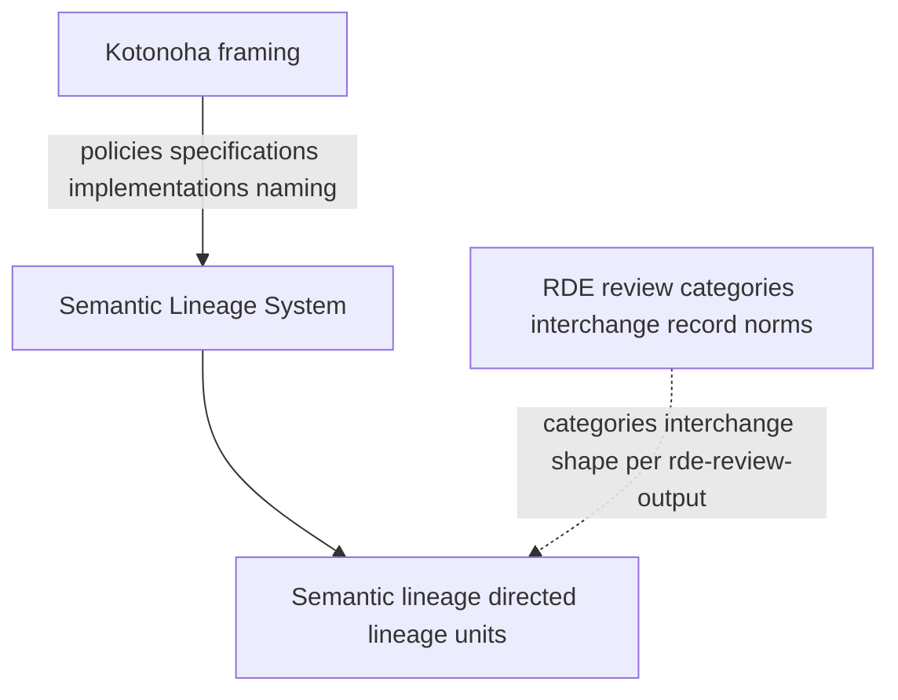
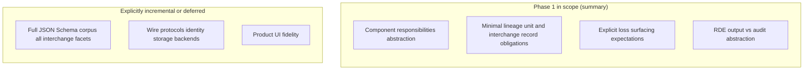
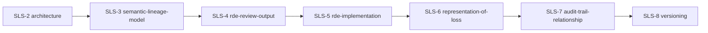

# SLS-1 Introduction

## SLS-1.1 Purpose

This document establishes scope, terminology, and conformance language for the **Semantic Lineage System (SLS)** public specification bundle maintained in this repository. Together with the other Phase 1 documents, it defines a **minimal reviewable surface** for implementations and integrations without pretending to finalize every data structure.

SLS is not merely a semantic diff or data interchange specification. It is an institutional specification for making meaning changes reviewable by recording who observed what change, under which context, with which limits, and what remains open to re-examination.

*Non-normative Japanese illustrative companion:* [introduction_ja.md](introduction_ja.md) (figures and notes; conforms to EN source).

## SLS-1.2 Normative content

Documents under `docs/` linked from [README.md](README.md) in this directory are **normative for Phase 1** unless marked explicitly as non-normative in their body.

The top-level [README.md](../README.md) of the repository is primarily informative (repository policy and links).

## SLS-1.3 Conformance keywords

The key words **MUST**, **MUST NOT**, **SHOULD**, **SHOULD NOT**, **MAY**, and **OPTIONAL** are to be interpreted as described in [BCP 14](https://www.rfc-editor.org/info/bcp14) ([RFC 2119](https://www.rfc-editor.org/rfc/rfc2119.html) and [RFC 8174](https://www.rfc-editor.org/rfc/rfc8174.html)) when, and only when, they appear in all capitals in normative sections.

## SLS-1.4 Definitions

### SLS-1.4.1 Semantic Lineage System (SLS)

**SLS** denotes the family of structures and processes for recording **semantic lineage**: how meaning is preserved, transformed, complemented, left unresolved, lost, or exposed to deviation risk across changes—not merely string or token deltas.

SLS does not claim to preserve meaning as a fixed object. Instead, SLS preserves the traceability, contestability, and reviewability of meaning-relevant change across lineage units, review outputs, and human or institutional decisions.

### SLS-1.4.2 Kotonoha

**Kotonoha** names the institutional framing of SLS within this ecosystem (policies, specifications, and implementations). **Implementations MUST NOT treat “Kotonoha” as only a product nickname** when interpreting obligations that refer to semantic lineage or accountability.

Kotonoha is the ecosystem framing for SLS; it is **not** itself a claim that RDE automation is complete, authoritative, or sufficient for final semantic judgment.

### SLS-1.4.3 Semantic lineage

**Semantic lineage** is the directed, inspectable relationship among **lineage units** (see [SLS-3](semantic-lineage-model.md)) that records meaning-relevant provenance and change.

Semantic lineage is different from ordinary logging. A change log may record that something happened; semantic lineage records enough structured relationship for reviewers to inspect what meaning-relevant intent, scope, uncertainty, responsibility, tension, loss, or risk was carried forward, altered, or left unresolved.

### SLS-1.4.4 RDE review

**RDE** (**Resonant Deviation Evaluator**) denotes the structured review model defined **operationally** by the observation categories and interchange requirements in [SLS-4](rde-review-output.md). Normative requirements **MUST** use those categories; purely metaphorical descriptions **MUST NOT** substitute for them in normative clauses.

### SLS-1.4.5 ΔM (semantic change)

**ΔM** denotes a semantic change—shift in intent, scope, tension, or value—not equivalent to a raw text diff. Specifications MAY reference ΔM when contrasting semantic change from lexical change.

### SLS-1.4.6 Source context

**Source context** denotes the prior material, stated intent, lineage references, review notes, issue or pull-request context, or institutional constraints used to interpret a change. Source context is not assumed to be self-evident or singular. Implementations **SHOULD** preserve traceability to source context when it materially affects semantic lineage or RDE observations.

When source context is partial, contested, or unavailable, implementations **SHOULD NOT** overstate preservation, loss, or deviation conclusions as if the source were fully settled.

### SLS-1.4.7 Reviewability

**Reviewability** means that a human or institutional reviewer can inspect the relevant lineage relation, RDE observations, source context references, and recorded decisions sufficiently to challenge, accept, defer, or revise a semantic-change judgment.

Reviewability is weaker than automatic correctness. A conforming Phase 1 implementation may assist review without guaranteeing that every semantic change is fully or finally evaluated.

## SLS-1.5 Figures *(informative only)*

Diagrams **illustrate** definitions and applicability; they **do not** replace normative text in this introduction or sibling documents.

### SLS-1.5.1 Figure A — Institutional framing vs operationalized review

*Solid arrows recap institutional naming and lineage substrate; the dashed arrow highlights that operational **RDE obligations** tie to lineage subjects without replacing the lineage model.*

### SLS-1.5.2 Figure B — Applicability envelope

### SLS-1.5.3 Figure C — Suggested Phase 1 reading order

Following [docs/README.md](README.md):

Skip back to definitions in Introduction as needed for terminology anchored above.

## SLS-1.6 Applicability

### SLS-1.6.1 In scope for Phase 1

- Logical responsibilities of components.
- Minimal properties for a **lineage unit** and for an **RDE review output** interchange record.
- Requirements for explicit representation of **loss** of semantic elements.
- Expectations for correlating RDE outputs with **audit trails** at an abstract level.
- Minimal RDE implementation responsibilities.
- Boundary language for source context, semantic traceability, reviewability, and human accountability.

### SLS-1.6.2 Out of scope for Phase 1

- Complete JSON Schema artifacts for all interchange types (MAY be added incrementally).
- Concrete network protocols, RPC signatures, or storage engines.
- Product-specific UI specifications.
- Specific LLM, SLM, rule engine, classifier, model weight, or prompt requirements for RDE implementations.
- Claims that meaning can be fully preserved as a fixed object.
- Claims that automated RDE output is a final semantic judgment, approval, rejection, or publication authorization.
- Full multimodal semantic-change evaluation for images, audio, video, or other non-textual artifacts.

## SLS-1.7 Public boundary

Normative documents **MUST NOT** require readers to access **private** repositories, codenames, or undisclosed assets to interpret requirements. Internal drafts are out of scope for conformance.

## SLS-1.8 Human accountability

Automated tools, including future RDE implementations, **MUST NOT** be normatively specified as replacing human judgment, approval, or accountability for publication and design decisions. Tools **MAY** assist observation and recording.

Human accountability includes the ability to accept, reject, defer, reopen, or contest a semantic-change judgment. SLS artifacts and RDE review outputs may inform that process, but they do not by themselves settle responsibility.

## SLS-1.9 Phase 1 document map

The Phase 1 bundle under `docs/` is split so obligations stay **reviewable** without implying every interchange detail is already frozen. Typical reading order mirrors the Phase 1 table in [`docs/README.md`](README.md): [SLS-1 Introduction](introduction.md) → [SLS-2 Architecture](architecture.md) → [SLS-3 lineage model](semantic-lineage-model.md) → [SLS-4 RDE interchange](rde-review-output.md) → [SLS-5 RDE implementation](rde-implementation-specification.md) → [SLS-6 representation of loss](representation-of-loss.md) → [SLS-7 audit correlation](audit-trail-relationship.md) → [SLS-8 versioning](versioning.md).

| Document | Normative focus (abbreviated) | Deliberately incremental |
| --- | --- | --- |
| [SLS-2 Architecture](architecture.md) | Responsibilities for lineage representation, review output, interchange, audit correlation | No deployment topology; no identities |
| [SLS-3 Semantic lineage model](semantic-lineage-model.md) | Minimal **lineage unit** obligation (`id`, relationships) | Rich graph schema postponed |
| [SLS-4 RDE review output](rde-review-output.md) | Observation categories and **minimal** interchange logical shape | Full JSON Schema for every field |
| [SLS-5 RDE implementation specification](rde-implementation-specification.md) | Minimal RDE implementation responsibilities and boundaries | No model, prompt, latency, or hosting topology |
| [SLS-6 Representation of loss](representation-of-loss.md) | Requirements to surface **lost** semantics | Canonical loss object encoding ([issue tracking](https://github.com/zyx-corporation/kotonoha-spec/issues/3)) |
| [SLS-7 Audit trail relationship](audit-trail-relationship.md) | Correlation expectations between RDE outputs and audits | Operational audit schemas |
| [SLS-8 Versioning](versioning.md) | How incompatible changes evolve | — |

Public tracking for deferred normative gaps is managed through issues and pull requests on this repository; **implementations SHOULD still cite the relevant section identifiers** here when asserting conformance.

## SLS-1.10 Informative anchors (reference implementations)

The following OSS surfaces help exercise Phase 1 but **do not** replace normative text when judging conformance:

- [`kotonoha-core` interchange source (`kotonoha.interchange.v1`)](https://github.com/zyx-corporation/kotonoha-core/blob/main/src/interchange.rs)
- **[`kotonoha` CLI definition](https://github.com/zyx-corporation/kotonoha-cli/blob/main/docs/cli-definition.md)** (commands, validation, persistence, exit meanings)