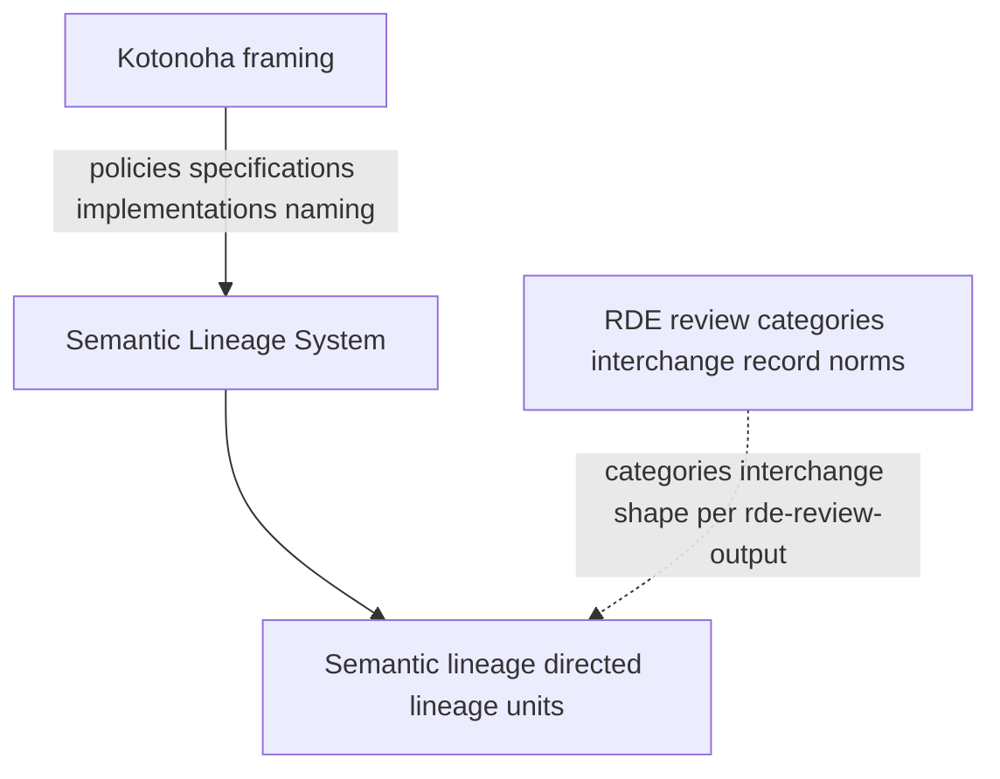
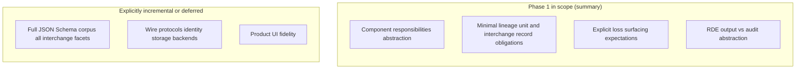
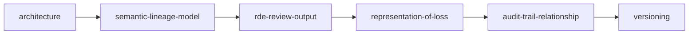

# Introduction

## Purpose

This document establishes scope, terminology, and conformance language for the **Semantic Lineage System (SLS)** public specification bundle maintained in this repository. Together with the other Phase 1 documents, it defines a **minimal reviewable surface** for implementations and integrations without pretending to finalize every data structure.

*Non-normative Japanese illustrative companion:* [introduction_ja.md](introduction_ja.md) (figures and notes; conforms to EN source).

## Normative content

Documents under `docs/` linked from [README.md](README.md) in this directory are **normative for Phase 1** unless marked explicitly as non-normative in their body.

The top-level [README.md](../README.md) of the repository is primarily informative (repository policy and links).

## Conformance keywords

The key words **MUST**, **MUST NOT**, **SHOULD**, **SHOULD NOT**, **MAY**, and **OPTIONAL** are to be interpreted as described in [BCP 14](https://www.rfc-editor.org/info/bcp14) ([RFC 2119](https://www.rfc-editor.org/rfc/rfc2119.html) and [RFC 8174](https://www.rfc-editor.org/rfc/rfc8174.html)) when, and only when, they appear in all capitals in normative sections.

## Definitions

### Semantic Lineage System (SLS)

**SLS** denotes the family of structures and processes for recording **semantic lineage**: how meaning is preserved, transformed, complemented, left unresolved, lost, or exposed to deviation risk across changes—not merely string or token deltas.

### Kotonoha

**Kotonoha** names the institutional framing of SLS within this ecosystem (policies, specifications, and implementations). **Implementations MUST NOT treat “Kotonoha” as only a product nickname** when interpreting obligations that refer to semantic lineage or accountability.

### Semantic lineage

**Semantic lineage** is the directed, inspectable relationship among **lineage units** (see [semantic-lineage-model.md](semantic-lineage-model.md)) that records meaning-relevant provenance and change.

### RDE review

**RDE** (**Resonant Deviation Evaluator**) denotes the structured review model defined **operationally** by the observation categories and interchange requirements in [rde-review-output.md](rde-review-output.md). Normative requirements **MUST** use those categories; purely metaphorical descriptions **MUST NOT** substitute for them in normative clauses.

### ΔM (semantic change)

**ΔM** denotes a semantic change—shift in intent, scope, tension, or value—not equivalent to a raw text diff. Specifications MAY reference ΔM when contrasting semantic change from lexical change.

## Figures *(informative only)*

Diagrams **illustrate** definitions and applicability; they **do not** replace normative text in this introduction or sibling documents.

### Figure A — Institutional framing vs operationalized review

*Solid arrows recap institutional naming and lineage substrate; the dashed arrow highlights that operational **RDE obligations** tie to lineage subjects without replacing the lineage model.*

### Figure B — Applicability envelope

### Figure C — Suggested Phase 1 reading order

Following [docs/README.md](README.md):

Skip back to definitions in Introduction as needed for terminology anchored above.

## Applicability

### In scope for Phase 1

- Logical responsibilities of components.
- Minimal properties for a **lineage unit** and for an **RDE review output** interchange record.
- Requirements for explicit representation of **loss** of semantic elements.
- Expectations for correlating RDE outputs with **audit trails** at an abstract level.

### Out of scope for Phase 1

- Complete JSON Schema artifacts for all interchange types (MAY be added incrementally).
- Concrete network protocols, RPC signatures, or storage engines.
- Product-specific UI specifications.

## Public boundary

Normative documents **MUST NOT** require readers to access **private** repositories, codenames, or undisclosed assets to interpret requirements. Internal drafts are out of scope for conformance.

## Human accountability

Automated tools, including future RDE implementations, **MUST NOT** be normatively specified as replacing human judgment, approval, or accountability for publication and design decisions. Tools **MAY** assist observation and recording.

## Phase 1 document map

The Phase 1 bundle under `docs/` is split so obligations stay **reviewable** without implying every interchange detail is already frozen. Typical reading order mirrors the Phase 1 table in [`docs/README.md`](README.md): [Introduction](introduction.md) → [Architecture](architecture.md) → lineage model → RDE interchange → representation of loss → audit correlation → versioning.

| Document | Normative focus (abbreviated) | Deliberately incremental |
| --- | --- | --- |
| [architecture.md](architecture.md) | Responsibilities for lineage representation, review output, interchange, audit correlation | No deployment topology; no identities |
| [semantic-lineage-model.md](semantic-lineage-model.md) | Minimal **lineage unit** obligation (`id`, relationships) | Rich graph schema postponed |
| [rde-review-output.md](rde-review-output.md) | Observation categories and **minimal** interchange logical shape | Full JSON Schema for every field |
| [representation-of-loss.md](representation-of-loss.md) | Requirements to surface **lost** semantics | Canonical loss object encoding ([issue tracking](https://github.com/zyx-corporation/kotonoha-spec/issues/3)) |
| [audit-trail-relationship.md](audit-trail-relationship.md) | Correlation expectations between RDE outputs and audits | Operational audit schemas |
| [versioning.md](versioning.md) | How incompatible changes evolve | — |

Public tracking for deferred normative gaps is managed through issues and pull requests on this repository; **implementations SHOULD still cite the relevant section headings** here when asserting conformance.

## Informative anchors (reference implementations)

The following OSS surfaces help exercise Phase 1 but **do not** replace normative text when judging conformance:

- [`kotonoha-core` interchange source (`kotonoha.interchange.v1`)](https://github.com/zyx-corporation/kotonoha-core/blob/main/src/interchange.rs)
- **[`kotonoha` CLI definition](https://github.com/zyx-corporation/kotonoha-cli/blob/main/docs/cli-definition.md)** (commands, validation, persistence, exit meanings)
