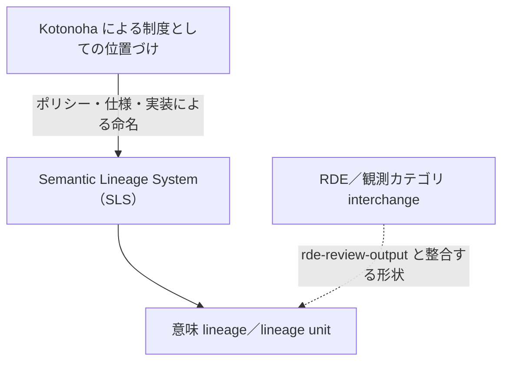
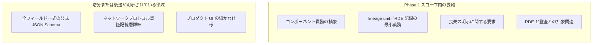
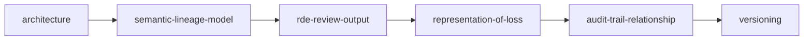

# はじめに（参考・日本語要約）

**正本:** 適合要件と定義は英語 [**`introduction.md`**（Introduction）](introduction.md) を参照してください。**本ページは規範（normative）ではありません。**

概要・図表は英語版と対応させ、日本語での読書補助に使います。次の構成は **`introduction.md` と同源**です。

---

## 目的の要約

**Semantic Lineage System（SLS）** を対象とする Phase 1 公開バンドルの **適用範囲・用語・適合の言語**を示す。**実装すべきレビューパックの下限**になるが、すべてのフィールド詳細まで固定しない。

---

## 規範テキストの所在

[`docs/` 配下、`README.md` の Phase 1 索引に列挙された文書](README.md)の本文が Phase 1 では規範です（本文自体が明示的に非規範と書いている場合は除く）。リポジトリ直下の [**`README.md`**](https://github.com/zyx-corporation/kotonoha-spec/blob/main/README.md) は主にインフォメーティブ（ポリシー・リンク）。

---

## 適合キーワードについて

規範節での **大文字の MUST／MUST NOT／SHOULD／MAY／OPTIONAL** は [BCP 14](https://www.rfc-editor.org/info/bcp14) で解釈します。詳しくは **[`introduction.md` § Conformance keywords](introduction.md)**。

---

## 用語ノート（要約）

- **SLS** … 「意味の系譜」（保存・変換・補完・未解決・喪失・逸脱など）を、文字単位の差分だけとは限らずに記録する仕組みの総称。**[詳細・規範文は英文 Introduction](introduction.md)**。
- **Kotonoha** … 本エコシステムで SLS を制度として名付ける側面（ポリシー／仕様／実装）。
- **意味の系譜（semantic lineage）** … **[`semantic-lineage-model.md`](semantic-lineage-model.md)** の **lineage unit** とその関係。
- **RDE review** … 観測カテゴリと interchange 上の論理構造。**[詳細・規範は `rde-review-output.md`](rde-review-output.md)** が正。
- **ΔM** … 意味の変化（意図・射程・張力など）を指すときの便宜的記号。字句差分とは同一視しない。

---

## 図表 *(参考のみ)*

規範文や英語原版を置き換えません。構造は英語 **[Introduction の Figures](introduction.md#figures-informative-only)** と対応します。

### Figure A — 制度的枠組みと RDE の位置づけ

実線は制度名と lineage 下地、破線は **RDE が lineage の対象に対して観測・記録モデルを載せること** を示します（モデル詳細は英語規範へ）。

### Figure B — Phase 1 の適用エンベロープ

### Figure C — Phase 1 推奨読書順序

詳細には **[docs/README の英語索引](README.md)** に従います。

用語確認は **`introduction.md`（または本ページの用語ノート）へ戻って**問題ありません。

---

## Applicability／公開境界／説明責任（ひとこと）

- **適用**: [英文 § Applicability](introduction.md)。
- **公開境界**: 仕様読解に **非公開リポジトリ等を要求しない**。
- **人間**: 自動化ツールは **規範上、人間の判断・承認・説明責任を置き換えない** ([§ Human accountability](introduction.md))。

---

## Phase 1 文書マップの要約

**規範の全文はすべて英語**。日本語での役割の把握用に一覧します（増分許容メモも英文に準拠）。

| 英文ドキュメント | 日本語メモでの役割 | 増分許容メモ（要約） |
| --- | --- | --- |
| [architecture.md](architecture.md) | lineage／RDE／interchange／監査相関の論理責務 | 配置／識別子までは規定しない |
| [architecture_ja.md](architecture_ja.md) | （参考・図）責務関係の図解のみ | — |
| [semantic-lineage-model.md](semantic-lineage-model.md) | lineage unit と関係の**最小要件**（`id` 等） | リッチなグラフ型は翌段へ |
| [rde-review-output.md](rde-review-output.md) | カテゴリと interchange **最小論理構造** | 全項目の公式 JSON Schema |
| [representation-of-loss.md](representation-of-loss.md) | 喪失（lost）語義の明示要求 | 正準オブジェクト詳細 ([#3](https://github.com/zyx-corporation/kotonoha-spec/issues/3)） |
| [audit-trail-relationship.md](audit-trail-relationship.md) | RDE と監査記録との相関 | 運用上の監査スキーマは別段 |
| [versioning.md](versioning.md) | normative の互換変更の門番 | — |

総合索引（英語優先）は **[仕様書索引 README](README.md)**。一覧の日本語補助は **[README_ja.md](README_ja.md)**。

論理構成の視覚化：**[`architecture_ja.md` の Figures](architecture_ja.md)**。

---

## 実装側のインフォメーティブな入口（適合判定の代替ではない）

- [`kotonoha-core` `interchange`（`kotonoha.interchange.v1`）](https://github.com/zyx-corporation/kotonoha-core/blob/main/src/interchange.rs)
- [**`kotonoha` CLI 定義**](https://github.com/zyx-corporation/kotonoha-cli/blob/main/docs/cli-definition.md)

---

英語ソースと齟齬がある場合は常に **`introduction.md`（および各 normative の英文本文）が優先**です。
