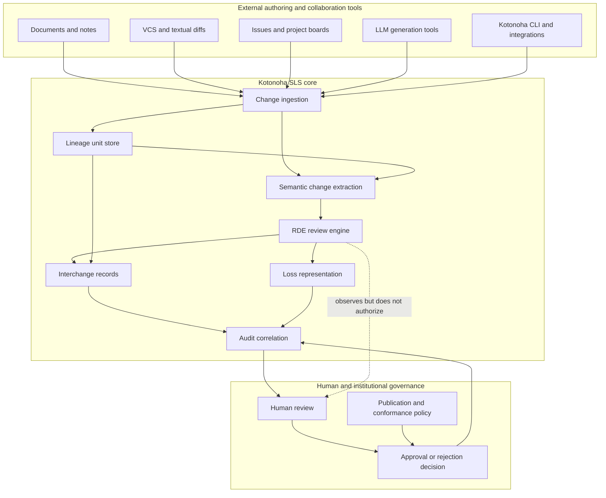
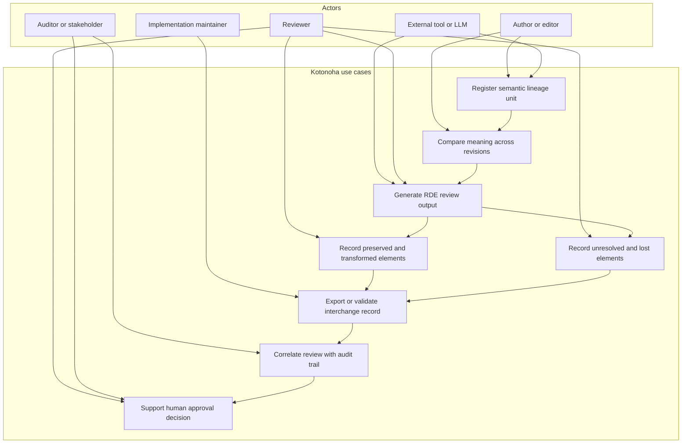

# Requirements overview

Status: **Informative**. This document summarizes the system-level requirements, architecture picture, and use cases for Kotonoha as a Semantic Lineage System (SLS). Normative requirements remain in the Phase 1 specification documents linked from [docs/README.md](README.md). If this document conflicts with a normative Phase 1 document, the normative document prevails.

## Purpose

Kotonoha is the public specification and ecosystem framing for SLS: a system family for recording how meaning is preserved, transformed, complemented, left unresolved, lost, or exposed to deviation risk across changes.

The core requirement is not merely to store document versions. Kotonoha must make meaning-relevant change inspectable. It therefore combines semantic lineage, RDE review outputs, interchange records, and audit correlation into a reviewable structure.

## System goals

Kotonoha should support the following goals:

1. Preserve semantic lineage across revisions, generated outputs, reviews, and decisions.
2. Distinguish lexical or file-level diffs from semantic change, or ΔM.
3. Represent RDE observations as structured review outputs rather than informal comments alone.
4. Surface lost semantic elements instead of silently collapsing them into a later version.
5. Correlate RDE outputs, lineage units, and audit trails without treating automated review as final human authority.
6. Interoperate with existing collaboration tools such as Git, issues, project boards, editors, and CLIs.
7. Keep Phase 1 implementation obligations small enough to be reviewable and externally stable.

## Overall architecture

The following diagram shows the full conceptual architecture including RDE. It expands the Phase 1 logical architecture into a product-facing view while preserving the same boundary: Kotonoha may integrate with collaboration tools, but it does not replace them.

### Component responsibilities

| Component | Responsibility | Phase 1 expectation |
| --- | --- | --- |
| Change ingestion | Accept change subjects from documents, diffs, generated text, issues, or tools | Keep source references traceable |
| Lineage unit store | Persist directed semantic lineage units | Follow the minimal lineage unit model |
| Semantic change extraction | Identify meaning-relevant change candidates distinct from textual diffs | May remain implementation-defined in Phase 1 |
| RDE review engine | Produce or consume structured RDE observations | Use the RDE categories and interchange shape |
| Loss representation | Record semantic elements that are removed, weakened, or no longer represented | Surface loss explicitly |
| Interchange records | Serialize lineage and RDE payloads for tool exchange | Follow Phase 1 interchange rules |
| Audit correlation | Relate reviews, lineage, interchange records, and decisions | Preserve correlatable references |
| Human governance | Decide publication, acceptance, rejection, or revision | Automated RDE output must not replace accountability |

## Use case diagram

The following use case diagram is represented as a flowchart so it remains readable in plain Markdown and GitHub rendering.

## Primary use cases

### UC-1: Register a lineage unit

An author, tool, or integration registers a meaning-bearing unit such as a document revision, generated passage, edited design note, or specification fragment. The system records an identifier and lineage relationship sufficient for later inspection.

### UC-2: Compare semantic change across revisions

A reviewer compares a prior state and a later state. The result is not only a textual diff but an account of semantic change: what was preserved, transformed, complemented, left unresolved, or lost.

### UC-3: Generate an RDE review output

An RDE implementation or reviewer produces structured observations about semantic deviation. These observations should be represented as review output records, not as final authorization decisions.

### UC-4: Record loss explicitly

When an element from the source meaning is weakened, omitted, erased, or made ambiguous, Kotonoha records that loss so it can be reviewed rather than hidden by a polished later document.

### UC-5: Correlate review and audit trail

A stakeholder traces a final decision back to lineage units, RDE observations, interchange records, and human review actions. The purpose is institutional accountability, not merely debugging.

### UC-6: Exchange records between tools

Implementations exchange minimal lineage and RDE payloads through documented interchange records. Phase 1 keeps this small; future phases may add richer schemas and protocols.

## Functional requirement summary

| ID | Requirement | Notes |
| --- | --- | --- |
| FR-1 | The system shall represent semantic lineage units and relationships. | Normative details live in `semantic-lineage-model.md`. |
| FR-2 | The system shall support RDE review output records. | Categories and minimal shape live in `rde-review-output.md`. |
| FR-3 | The system shall distinguish semantic change from raw textual diff. | Extraction strategy may vary by implementation. |
| FR-4 | The system shall expose lost semantic elements when known or asserted. | See `representation-of-loss.md`. |
| FR-5 | The system shall provide or consume interchange records for lineage and review data. | Versioning rules apply. |
| FR-6 | The system shall preserve correlation between review outputs and audit trails when audit trails exist. | See `audit-trail-relationship.md`. |
| FR-7 | The system shall keep automated observations separate from human decision authority. | RDE observes; humans remain accountable. |
| FR-8 | The system should support references to external tools and repositories without requiring them as replacements. | Git, issues, project boards, and editors may coexist. |

## Non-functional requirement summary

| ID | Requirement | Notes |
| --- | --- | --- |
| NFR-1 | Reviewability | Public specifications should remain small, stable, and externally inspectable. |
| NFR-2 | Traceability | Implementations should cite relevant specification sections when claiming conformance. |
| NFR-3 | Interoperability | Records should be usable across CLI, core libraries, editor plugins, and documentation tools. |
| NFR-4 | Human accountability | Automation must assist review without replacing publication or approval responsibility. |
| NFR-5 | Evolvability | Incompatible changes must follow the versioning policy. |
| NFR-6 | Public boundary | Conformance must not depend on private repositories or undisclosed drafts. |

## Out of scope for this overview

This document does not define wire protocols, authentication, tenancy, storage engines, UI fidelity, complete JSON Schema coverage, benchmark methodology, or implementation-specific model choices for RDE. Those may be addressed in later specification phases or implementation repositories.

## RDE boundary

RDE is included as a core review responsibility of Kotonoha, but it is not the whole system. RDE classifies and records semantic deviation observations. SLS stores and relates semantic lineage. Audit correlation connects records to accountable decisions. Human governance decides whether a change is accepted, rejected, revised, or published.

## RDE-oriented checklist for future updates

When this overview or related specifications are updated, reviewers should ask:

| Question | Purpose |
| --- | --- |
| What was preserved from the source concept? | Avoid losing the original design intent. |
| What was transformed? | Make authorized changes visible. |
| What was complemented? | Separate useful extension from unsupported invention. |
| What remains unresolved? | Prevent ambiguity from becoming hidden doctrine. |
| What drift risk was introduced? | Detect overclaiming, narrowing, or implementation leakage. |
| What should the next update clarify? | Keep the specification evolvable. |
